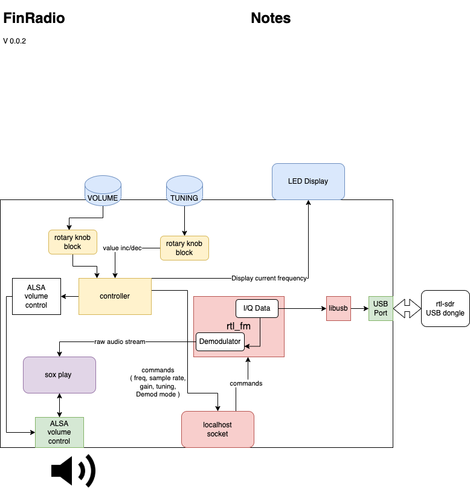
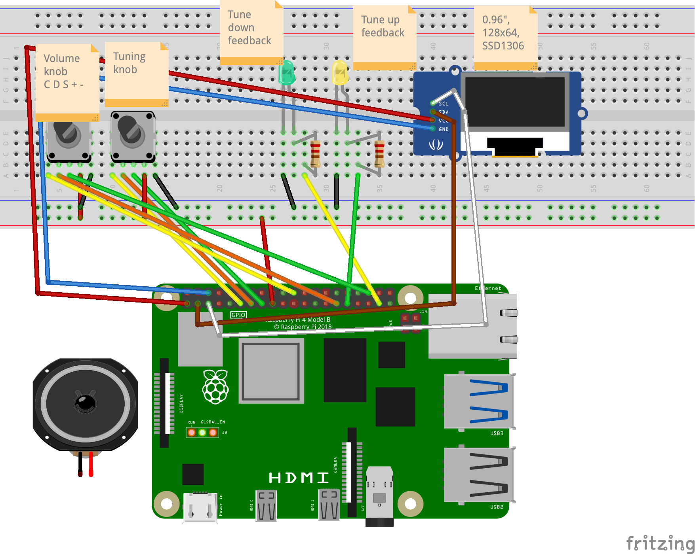
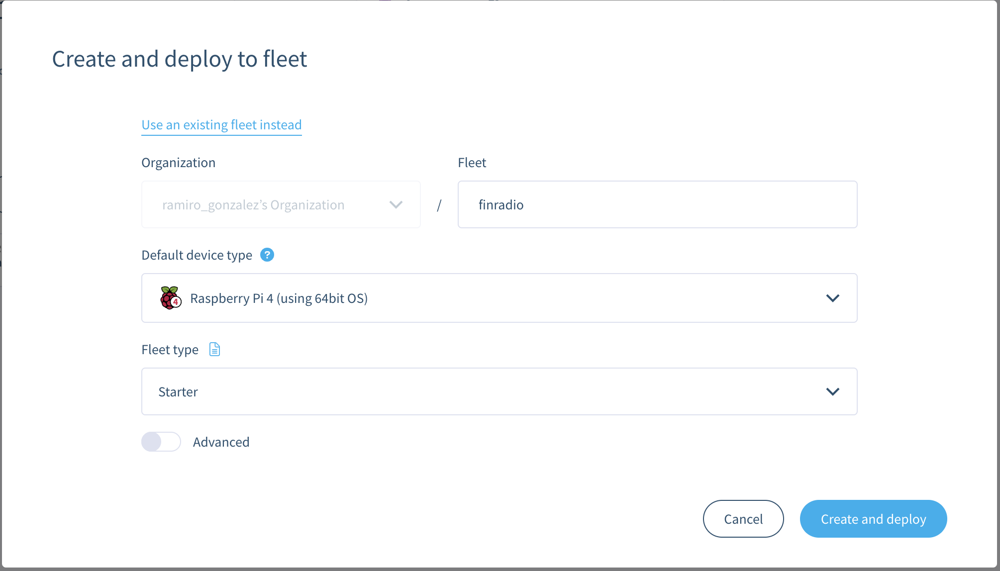
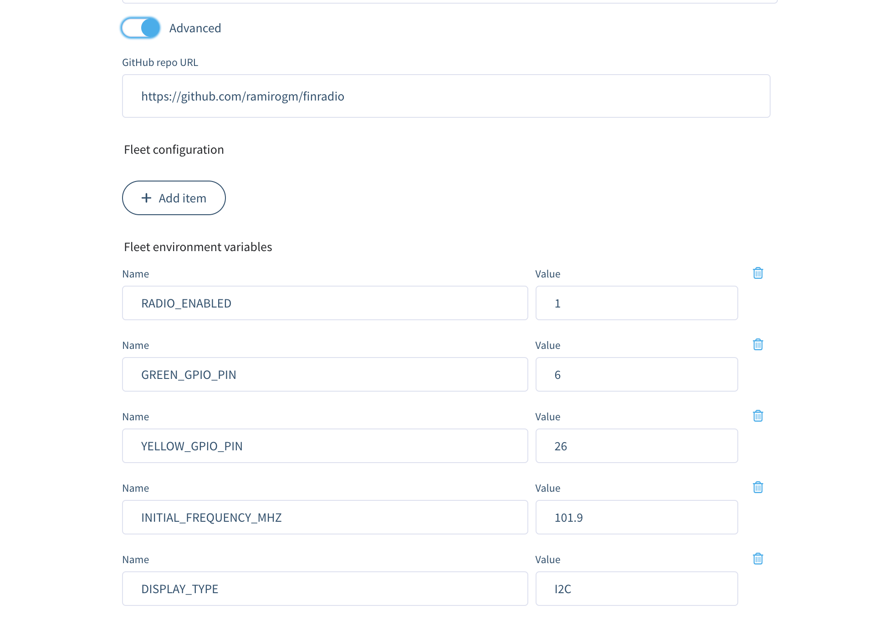
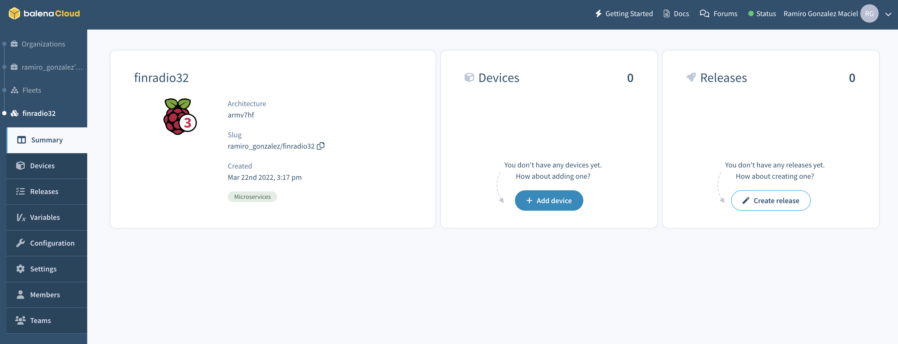
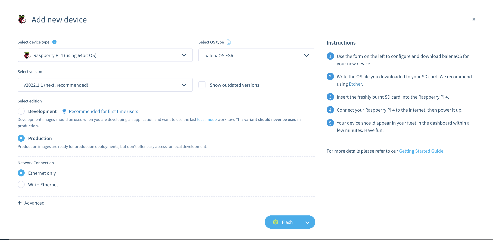
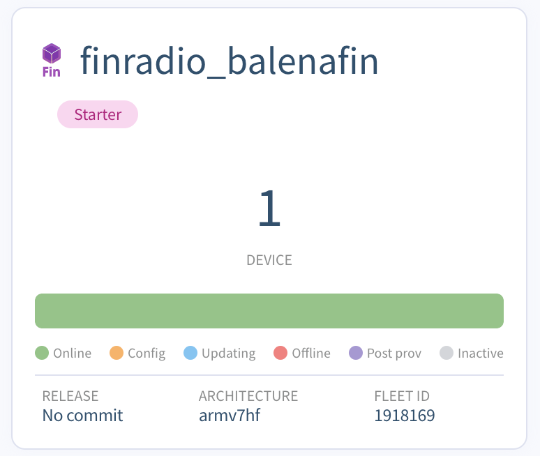
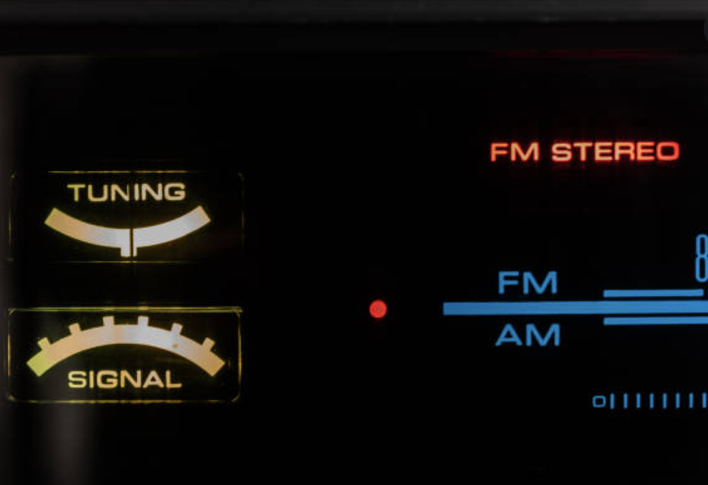

# FinRadio, a Radio receiver built with Balena


In this blog post I show how to build a Software-defined FM Radio Receiver starting with a SDR dongle and a Pi or balenaFin, and then building from it to create different variations. We can build a standalone, nice looking radio appliance by adding a pair of rotary knobs for Volume and Tuning, a display, speakers and putting all of them in a wooden case. The tutorial also shows different alternatives on the input side, like using a keyboard instead of the rotary knobs, and on the display side. This project was built during my residency at the balenaLabs


## Software defined radio

SDR is an awesome and super fun piece of tech that you can use with a Pi to build a whole range of amazing apps, and learn a lot in the process. You can build a [radar-like app to watch for airplanes nearby](https://hub.balena.io/ketil/balena-ads-b), build [GPS based](https://github.com/gnss-sdr/gnss-sdr) apps, [scan frequencies around you](https://www.balena.io/blog/running-openwebrx-on-balena-to-remotely-monitor-local-radio-spectrum/) to then dig on what's being transmitted, or try to decode the protocol used by a [433Mhz device](https://github.com/merbanan/rtl_433). A great example of the later, and one of the first references to SDR that I heard of btw, is how you can use a SDR to [reverse-engineer the protocol used by an insulin pump](https://www.hanselman.com/blog/software-defined-radio-is-a-great-way-to-bridge-the-physical-and-the-digital-and-teach-stem). Even though most of these applications already exist, SDR allows you to build and learn at different levels, from the raw signal processing up to working at a high level with an audio stream.


## What's a balenaLabs Residency?

As I mentioned above this project was done during my weeks doing the [residency at balenaLabs](https://www.balena.io/blog/balenalabs-residencies-our-quest-to-improve-onboarding-at-balena/). These weeks have been a lot of fun; I've learned a lot about the platform, got to know the balena team, all while keeping focus on building one thing and adjusting the pace and goals as I refined the product and made progress.

As a quick note, here's a list of different things I've learned in these past weeks, just to give a glimpse of how great this program is to do a useful and fun onboarding:

* Local mode is amazing, you can build locally and deploy to a Pi sitting next to you, debug your apps, very easily using the `balena` CLI.
* I had *some* previous experience with a RaspberryPI, developing really small apps using NodeRED and some cloned examples. I learned **a lot** ( in comparison ) during these weeks.
  * Input devices
    - rotary encoders: the basic ones can be read using GPIO pins since they provide "click" events
    - potentiometers are analogic; you need an A/D converter like the MCP3008
  * Displays: The simple ones use a library that connects through I2C or SPI. You draw pixels, lines, text. These are fun to work with.
  * You can also connect a TFT touch scren and basically use it as a you would a display, using X, or a [browser block](https://www.balena.io/blog/how-to-make-your-own-balenablocks-simple-drop-in-edge-app-functionality/). It's like connecting a monitor to HDMI. Yes, not fun, nothing to do here *once* you get the wiring right. I couldn't make an unbranded 240x240 IPS with a ST7789 controller work _yet_
* UDP is underrated. I really didn't have UDP in my mind as a valid choice when thinking about defining a new protocol to communicate with an app. But after digging into the implementation of `rtl_udp` and `rtl_tcp` which use UDP for a simple command protol, I compared to the alternatives I'm used to work with which are basically TCP based protocols ( HTTP, Kafka/MQ, gRPC etc) and using UDP made perfect sense. It is used to exchange small packets, there's no concept of a stream or connection, so why would you use a heavier stack?.
  * For the rotary-reader I designed a basic "publish" or "broadcast" protocol based on UDP. The rotary-reader needs to publish events which can be packed into 9 bytes. There is really no big deal if a packet is lost and the possibility of losing an UDP packet on a localhost connection seems pretty low; the packets are generated based on a person rotating the knob so we're talking about a really low volume of packets. The code is really simple using UDP also.
* I also learned that the way to create reusable components in balena is to create a block, so since I'm already using two rotary knobs I went ahead and created a [rotary knob block](https://github.com/ramirogm/rotary-knob#rotary-knob)


## Tutorial organization

We're going to build an FM receiver radio using balena. The tutorial will show all the steps to build a standalone radio with a case and antenna. Since I also want to show the building blocks and alternatives you could use if you want to build something different of my final product, the tutorial is organized around building the basic blocks first and then adding features and polishing the finished prorotype.

## Software

FinRadio - that's the name of our radio - encompasses a hardware side ( board, SDR dongle, knobs, display, leds ) and a software side - the FinRadio app. FinRadio is a balena multicontainer app, which means that there's a set of containers that handle different aspects and provide the modularity that allows us to build different varieties of the radio based on the hardware we have at hand. This diagram shows a component view of the software:

**FIXME**: _add the keyboard as an alternative input on the diagram_



## Building the Radio

### Bill of materials

As a minimum you need:

- A board. I've tested with a Raspberry Pi 4B and a balenaFin. If using a balenaFin then you'd need to add an USB sound card to be able to play through an audio jack. Something like [this sound board](https://www.adafruit.com/product/1475)  or even one [with speakers](https://www.adafruit.com/product/3369). _Note that I haven't tested any of these yet_
- A SDR receiver. I use mainly a [NooElec NESDR SMArt HF Bundle](https://www.amazon.com/-/es/Nooelec-NESDR-Smart-HF-Bundle/dp/B0747PX3NZ/ref=sr_1_5?__mk_es_US=%C3%85M%C3%85%C5%BD%C3%95%C3%91&crid=HAFBTX414EUU&keywords=nooelec+nesdr+smart&qid=1647996086&sprefix=nooelec+nesdr+smart+hf+bundle%2Caps%2C227&sr=8-5&language=en_US). I also bought a [cheap USB dongle](https://articulo.mercadolibre.com.ar/MLA-797334923-receptor-sdr-chip-rtl2832u-r820t2-radioescucha-25mhz-a-2ghz-_JM?quantity=1) and it works perfectly. Note that if you plug this in you can't plug an Ethernet cable on a Pi as the sockets are too close - The [nooelecs](https://www.amazon.com/-/es/Nooelec-NESDR-Smart-v4-SDR/dp/B01HA642SW/ref=sr_1_4?__mk_es_US=%C3%85M%C3%85%C5%BD%C3%95%C3%91&crid=30THJ5CEUIBWD&keywords=SDR&qid=1647996075&refresh=1&sprefix=sdr%2Caps%2C248&sr=8-4) don't have this problem.
- Some kind of speakers connected to the Audio jack on the Raspberry Pi. Don't forget to turn the speakers on!. [I bought this pair and they're small and sound ok](https://articulo.mercadolibre.com.ar/MLA-775450895-parlantes-pc-computadora-notebook-netbook-tablet-noga-ng-106-_JM?quantity=1&variation_id=47840885316) I also bought [a pair of Logitechs which are a little bigger](https://www.mercadolibre.com.ar/parlante-logitech-z120-negro-y-blanco/p/MLA15931818?pdp_filters=item_id:MLA910491293) but have fuller sound.
- A breadboard

For the input you can choose between using a keyboard or rotary knobs.

* 2 rotary knobs. I have a pair of [Ky-040](https://articulo.mercadolibre.com.ar/MLA-869711164-modulo-encoder-rotativo-ky-040-20-vueltas-arduino-unoelectro-_JM?quantity=2) rotary encoders.
* 2 nicely looking knobs. [I got these in black](https://articulo.mercadolibre.com.ar/MLA-696351558-perilla-potenciometro-knob-15x17-dorada-negra-_JM?quantity=4)

I also used a couple of LEDs during the development phase to easily validate that the inputs were working as expected

* 2 LEDs, one yellow, one green
* 2 resistors to avoid blowing up the LEDs

A display. I wanted to use a simple and cheap display instead of a screen. Further down I show how to use a screen over HDMI and other alternatives.

* 1 SSD1306 controlled OLED 128x64 display. I got a beautiful [one that displays the top 20-something rows in yellow and the rest in a shiny blue](https://articulo.mercadolibre.com.ar/MLA-743257264-pantalla-oled-display-096p-arduino-raspberry-arm-i2c-iic-se-_JM?quantity=1). See options below if you want to use something different

_Note: that the links I've added are from the devices I've tested, and as you'll see they're from local sellers in Argentina. These are very common parts so they should be available everywhere_


### Steps

#### Wiring

For the full version, you need to wire the components according to the following diagram. If you change the GPIO pins take note so that you can later update the config using fleet variables or directly on `docker-compose.yaml`.



#### Prototype

This is how it actually looks once you finish the wiring. This is the setup I used while developing the app:


#### Final case

I'm still working on putting all the components inside a case so that it can be used as a "regular" radio. Here are some pictures of the WIP:

<table>
  <tr>
    <td>
        
    </td>
    <td>Radio case to-be
    </td>
  </tr>
  <tr>
    <td>
        
    </td>
    <td>Hopefully I'll be able to use these speakers
    </td>
  </tr>
  <tr>
    <td>
        
    </td>
    <td>Taking out the bottom
    </td>
  </tr>
  <tr>
    <td>
        
    </td>
    <td>One knob in place
    </td>
  </tr>

</table>


As you can see I still need to keep working on this:

- Make room to put the display
- Wire the knobs and display
- Put the Pi + USB dongle
- Place the antenna
- Connect the speakers
  

## Running

### If you already have a fleet

You need to create a fleet on your balena account and push this app to it.

For example, if you already have a fleet named `bravo_fin_2`:

Let's push to the `bravo_fin_2` fleet

```shell
balena push bravo_fin_2
```

You'll see a looong log of docker building the image the first time; next ones most of it would be cached.

If you see a unicorn then we're good! And after a minute or two you should be listening to the radio on your Pi!


```
[Info]     Build finished in 3 minutes, 17 seconds
                            \
                             \
                              \\
                               \\
                                >\/7
                            _.-(6'  \
                           (=___._/` \
                                )  \ |
                               /   / |
                              /    > /
                             j    < _\
                         _.-' :      ``.
                         \ r=._\        `.
                        <`\\_  \         .`-.
                         \ r-7  `-. ._  ' .  `\
                          \`,      `-.`7  7)   )
                           \/         \|  \'  / `-._
                                      ||    .'
                                       \\  (
                                        >\  >
                                    ,.-' >.'
                                   <.'_.''
                                     <'
```

### Creating and deploying to a fleet

All you need to do is click the deploy button below:

[](https://dashboard.balena-cloud.com/deploy?repoUrl=https://github.com/ramirogm/finradio)

You will then be lead to creating a fleet in the balena dashboard. Choose `Raspberry Pi 4B` as the default device type and then click `advanced` to further detail the configuration of the fleet. Below there is a section that explains all of the variables you see in the advanced page. You can change these values later on if you want to create the fleet first and worry about the configuration later.





After deploying the fleet, you should see something like this:


Now, it's time to add your device(s) to the fleet. Press `add device` on the dashboard and then select how you want your device image to be configured. We suggest selecting the `development` edition for first time users so you can iterate and develop locally. Afterwards, connect your SD Card to your PC and press `flash` to flash the image.


Insert the newly flashed SD card to your device, turn it on, and you should see it in the dashboard in a few minutes.

If you're using a `balenaFin` you can flash directly from balena Etcher to the fin. Once you do that and after you reboot the device you'll see it added to the fleet 


## Hardware alternatives

If you only got the SDR or are missing some pieces here are some alternatives.

### No rotary knobs

If you want to run the FinRadio without rotary knobs, then you can use the keyboard to change the tuning frequency and the volume.

Key assignments:

| Key | Function |
|:---|:----|
| a | Tune down |
| d | Tune up |
| s | Volume down |
| w | Volume up |


You need to set the environment variables so that the app knows where to read the keypresses from.

To get the id, plugin the keyboard, connect a terminal to the `controller` container and run `lsusb`. Example:

```log
Connecting to 9cf53107314f3cb2e482e2594c710116...
Spawning shell...
root@bf3b12b834c4:/usr/src/app# lsusb
Bus 002 Device 001: ID 1d6b:0003 Linux Foundation 3.0 root hub
Bus 001 Device 006: ID 05ac:020b Apple, Inc. Pro Keyboard [Mitsumi, A1048/US layout]
Bus 001 Device 005: ID 05ac:1003 Apple, Inc. Hub in Pro Keyboard [Mitsumi, A1048]
Bus 001 Device 004: ID 0bda:2838 Realtek Semiconductor Corp. RTL2838 DVB-T
Bus 001 Device 003: ID 045e:0745 Microsoft Corp. Nano Transceiver v1.0 for Bluetooth
Bus 001 Device 002: ID 2109:3431 VIA Labs, Inc. Hub
Bus 001 Device 001: ID 1d6b:0002 Linux Foundation 2.0 root hub
root@0b469551c9b8:/usr/src/app# 
```

Then update the values of `VENDOR_ID` and `PRODUCT_ID` ; on this example we'd set:

```yaml
- VENDOR_ID=05ac
- PRODUCT_ID=020b
```      

### No LED feedback pins

Nothing will break. Just be sure that the output pins are not connected to anything that may break!

## Usage and Customization

### List of all environment variables

To edit these values in the dashboard, simply press `Variables` on the left column.


| Env Var | Description | Default |
|:---|:----|:---|
| RADIO_ENABLED| Run the radio demodulator. Disable if you don't have a tuner and want to try the other features like turning the volume knob, or are just testing | 1 |
| GREEN_GPIO_PIN|  GPIO pin # where the Green Led is connected to | 6 |
| YELLOW_GPIO_PIN |  GPIO pin # where the Green Led is connected to |26 |
| INITIAL_FREQUENCY_MHZ|  Initial tuner frequency, in Mhz| 101.9 |
| DISPLAY_TYPE | Must be I2C or NONE | I2C |


### Environment variables that have to be changed through docker-compose

If you want to change the Tuning and Volume rotary knob pinouts, the you'd need to edit the `docker-compose.yaml`

Why is this? The app uses two instances of the `rotary knob` block and currently there's no way two map two different fleet variables to the same variable name, one on each container.


## Next Steps and ideas

The following are several ideas to extend the radio:

- For some cases and styles it may make more sense to use an LCD display. This would require using new "display module"
- We could add "Radio station preset buttons", of which there are [so](https://www.adafruit.com/product/481) [many](https://www.adafruit.com/product/1010) [styles](https://www.adafruit.com/product/1444) to choose from.
- Tuning to other frequencies like AM sounds doable from the software point of view, but may require some work on the antenna side and an upconverter to pick up these lower frequencies.
- Adding a "radio station search" feature
- Showing a "signal level" indicator. 


# Credits

- A key component of the app is the [rtl_fm](http://kmkeen.com/rtl-demod-guide/) program that is included in the rtl-sdr package. I'm actually using a fork that called [rtl_udp](./../sysrun__rtl-sdr/README.md): _rtl_udp is a copy of rtl_fm with a special feature: It opens a udp control port (currently fixed to 6020) which takes commands like changing the frequency or mode. No need to restart :)_

- References! While looking for ideas and references for my project I found or was told about these excellent related projects:

  * SDR: An spectrum visualization https://hub.balena.io/gh_jaomaloy/balena-rtl-power by Jao Maloloy-on `@jaomaloy`

  * A flight traffic app on Hub here: https://hub.balena.io/ketil/balena-ads-b

  * A Pi **transmitter** Cool if you want to broadcast FM from an audio source! https://hub.balena.io/grokbeer/rickroll-fm https://github.com/grokbeer/rickroll-fm

  * Alan Boris @alab128 did a great project that allows you to use OpenWebRX to listen to some frequencies and visualize the radio spectrum, packed as a balena app https://www.balena.io/blog/running-openwebrx-on-balena-to-remotely-monitor-local-radio-spectrum/

  * WAT!! A "Sound cabinet" https://balenaltd.io/rosswesleyporter/blog/make-the-extra-small-model/ This is excellent and beautiful, a cabinet where we can put the Pi. I could use this or an old radio. Or make two and use both!.


